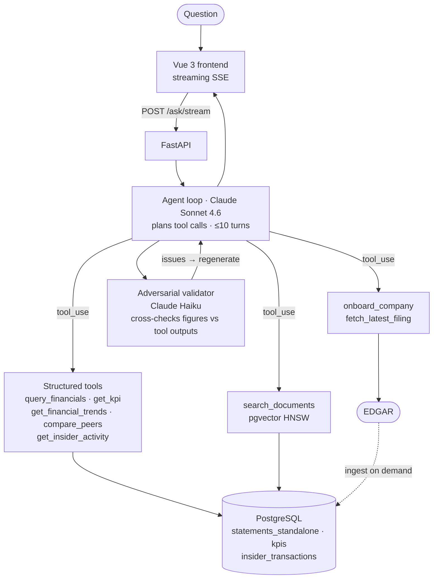

# FilingsDesk

**An agentic finance analyst that answers questions about any public company, with every figure cited to its SEC filing.**

FilingsDesk is a planner-plus-tools agent: you ask one natural-language question and the agent decides which of eight purpose-built tools to call, in what order, against what parameters. The answer comes back sourced — every number traced to a specific form, accession number, and filed date — with an adversarial validator that cross-checks each figure against raw tool outputs before the response reaches you.

---


*Ask about any SEC-registered company. FilingsDesk onboards the ticker from EDGAR on demand, calls the right tools, and returns a sourced answer in seconds.*

---

## What it does

- **GAAP financials** — income statement, balance sheet, and cash flow for any SEC-registered company, with de-cumulated standalone quarterly figures (not YTD)
- **Trend analysis** — multi-period trends with period-over-period and year-over-year deltas plus anomaly signals: `outlier | reversal | acceleration | deceleration`
- **Non-GAAP KPI extraction** — industry-agnostic: RevPAR and occupancy for hotels, same-store sales for retail, EBITDA margin for tech — extracted from 8-K earnings releases, not hard-coded
- **Document Q&A** — semantic search across indexed 10-Ks, 10-Qs, and 8-Ks; management commentary, MD&A, risk factors, guidance
- **Insider transactions** — Form 4 open-market purchases and sales with per-transaction provenance, distinguishing code-P open-market purchases from awards and tax-withholdings
- **Peer comparison** — any metric across any set of tickers for a given period, returned sorted with the focus company flagged
- **On-demand onboarding** — any public company loaded from EDGAR in 30–90 seconds; a three-state guard (not loaded / current / stale) means subsequent queries return immediately

---

## What makes it different

The core problem with "an LLM with EDGAR access" is that the model can produce numbers that look like real filings but aren't in any document. FilingsDesk solves this three ways:

**Grounded-only output.** The agent can only assert what a tool returned. Every figure in the answer has a `source_form`, `source_accession`, and `source_filed_date` field — the exact filing it came from. These travel through every database transform; they are never dropped.

**Adversarial validation.** After the agent drafts an answer, a separate Claude Haiku pass receives the full tool-call trace — including the first 2,000 characters of each tool result — and cross-checks every specific number, name, share count, and accession against that data. It flags five failure classes: fabricated specifics (figure not in any tool result), unsourced numbers (figure for a ticker where the tool returned 0 rows), derived-as-reported (computed value presented as directly reported), truncation gap fabrication (invented data past a truncated result), and missing required sections. On a flag, the answer is regenerated with the issues listed; the regeneration is framed as "write the final answer" to prevent meta-commentary from leaking through.

**Honest refusal.** If a tool returns 0 rows, the agent says so plainly rather than filling the gap from training data.

---

## Architecture



### Data layers

PostgreSQL is the single store for structured data and vector embeddings. Four layers, each queryable independently:

| Layer | Table | Contents |
|---|---|---|
| Raw | `raw_facts` | EDGAR XBRL `companyfacts`, as-is, never mutated. Provenance anchor. |
| Normalized | `statements` | Canonical GAAP line items. XBRL tag drift, extension tags, and overlapping filings resolved here. |
| Standalone | `statements_standalone` | De-cumulated single-quarter figures. Q2/Q3/Q4 derived via LAG subtraction; Q1 and balance sheet pass through unchanged. `is_derived` flag tracks which rows were computed. |
| Marts | `kpis` · `doc_chunks` · `insider_transactions` | Non-GAAP metrics extracted from 8-Ks; 1024-dim embeddings for RAG; Form 4 transactions with open-market flag. |

Vector retrieval uses a pgvector HNSW index (`m=16, ef_construction=64`) over `doc_chunks`. Metadata filters (ticker, form, date range) and cosine similarity run in a single SQL query — no separate vector store.

### Tool contracts

All eight tools return data and provenance, never prose. The agent composes the answer from tool outputs.

| Tool | Source | Returns |
|---|---|---|
| `query_financials` | `statements_standalone` | GAAP line items with full provenance |
| `get_kpi` | `kpis` | Non-GAAP metrics with source accession |
| `get_financial_trends` | `statements_standalone` + `kpis` | Multi-period series with PoP/YoY deltas and anomaly signal |
| `compare_peers` | `statements_standalone` + `kpis` | One metric across a ticker set, focus company flagged |
| `search_documents` | `doc_chunks` (pgvector) | Ranked chunks with metadata; k capped at 5 |
| `get_insider_activity` | `insider_transactions` | Form 4 rows with `is_open_market` flag |
| `fetch_latest_filing` | EDGAR live | New filing metadata since a given date |
| `onboard_company` | EDGAR → all layers | Full ingest or incremental top-up; returns state signal |

---

## Engineering decisions

### Fiscal-year-aware de-cumulation

XBRL income and cash flow values are YTD-cumulative: Q3 revenue is nine months, not three. FilingsDesk converts them to clean single-quarter figures using a LAG subtraction keyed on `(ticker, line_item, fiscal_period)`. This handles non-calendar fiscal years correctly — Intuit's fiscal year ends July 31, Salesforce's January 31 — because the subtraction is anchored to the company's own prior-period row, not a calendar assumption. The resulting `statements_standalone` table is what all query tools read; `statements` is kept as the unmodified raw anchor.

### Three-state onboarding guard

`onboard_company` runs a state machine gated on the `companies` table (authoritative registration record), not on the data status fields:

1. **Not registered** → full onboard: resolve CIK from EDGAR, ingest XBRL, index documents, extract KPIs, load Form 4 (30–90 seconds)
2. **Registered, cache fresh** → return immediately; a `last_staleness_check_at` timestamp suppresses EDGAR metadata calls for 24 hours
3. **Registered, cache stale** → three lightweight EDGAR metadata calls to check latest filing dates; if new filings exist, run a narrowed incremental ingest scoped to only the new date window

The `force_refresh` parameter bypasses the guard for manual re-ingest; it is never set by default.

### Industry-agnostic KPI extraction

KPIs are not pre-defined per company. The extraction pipeline uses a two-step approach: a discovery pass identifies what metrics a company actually reports in its 8-K earnings releases, then a targeted retrieval pass extracts their values. Relative-scale plausibility checks (e.g., occupancy rate must be between 0 and 1, RevPAR must be in the $50–$800 range for hotels) catch extraction errors without requiring per-metric configuration. This means the same pipeline extracts RevPAR for a hotel REIT, same-store sales for a retailer, and net revenue retention for a SaaS company.

### Retrieval and turn-limit hardening

Two failure modes were observed in testing and fixed with explicit constraints:

- **Search thrashing**: the agent would call `search_documents` repeatedly with rephrased queries that return the same chunks. Fixed by: (a) raising `k` from 3 to 5 so the first call is more likely to contain the answer; (b) a hard cap of 2 `search_documents` calls per question in the routing skill; (c) an explicit instruction that semantically similar queries return the same chunks, so re-searching is never useful.
- **Turn exhaustion**: on open-ended multi-tool questions, the agent would keep calling tools instead of synthesizing. Fixed by injecting a "write your answer now" nudge at turn 8 (when 3 turns remain) if at least 3 tool calls have already run.

---

## Tech stack

| Layer | Technology |
|---|---|
| Agent | Claude Sonnet 4.6 (planner) · Claude Haiku (validator) |
| Embeddings | Voyage AI `voyage-finance-2` · 1024 dimensions |
| Backend | Python 3.11 · FastAPI · SSE streaming |
| Database | PostgreSQL · pgvector (HNSW, single store for data + embeddings) |
| EDGAR ingestion | `edgartools` |
| Frontend | Vue 3 · custom CSS · `marked` for markdown rendering |
| Testing | pytest (every tool tested against a seeded database) |

---

## Running locally

**Prerequisites:** PostgreSQL with the `pgvector` extension, Python 3.11+, Node.js 18+.

```bash
# 1. Clone and install Python dependencies
git clone https://github.com/your-username/filingsdesk
cd filingsdesk
python -m venv .venv && source .venv/bin/activate   # Windows: .venv\Scripts\activate
pip install -r requirements.txt

# 2. Configure environment
cp .env.example .env
# Edit .env — four required variables:
#   DB_URL=postgresql://localhost/filingsdesk
#   ANTHROPIC_API_KEY=sk-ant-...
#   VOYAGE_API_KEY=pa-...
#   EDGAR_IDENTITY=Your Name <your@email.com>   # required by SEC fair-access rules

# 3. Create database and run schema
createdb filingsdesk
psql filingsdesk -c "CREATE EXTENSION IF NOT EXISTS vector;"
psql filingsdesk -f db/schema.sql

# 4. (Optional) Load seed data for a first company
python -m scripts.load_seed   # loads an initial ticker with sourced figures

# 5. Start the backend
uvicorn api.main:app --reload --reload-dir api --reload-dir agent --reload-dir tools --port 8000

# 6. Start the frontend (separate terminal)
cd frontend && npm install && npm run dev
```

Open [http://localhost:5173](http://localhost:5173). Type any question about a public company — if the ticker isn't loaded, `onboard_company` runs automatically.

**Building a Docker image:**
```bash
docker compose up --build
```

**Running tests:**
```bash
pytest   # all tools tested against the seeded database
```

---

## Limitations and future work

**Retrieval is pure-vector today.** Hybrid retrieval (BM25 + vector) with cross-encoder reranking is the next planned improvement. The motivation is occasional misses on exact figures that appear in supplemental tables deep in a document — lexical matching would catch those while semantic similarity alone sometimes doesn't.

**Single-agent architecture.** The current loop is one agent with eight tools. A multi-agent refactor — orchestrator that delegates to specialists (a financials analyst, a document researcher, a validator) with typed structured outputs — would improve reliability on complex multi-part questions and make individual tool failures easier to diagnose and retry.

**GAAP and non-GAAP are adjacent in the same query path.** `get_kpi` and `query_financials` share the same agent context. For companies that report non-GAAP metrics that closely shadow GAAP equivalents (Adjusted EBITDA vs. Operating Income), the agent occasionally needs explicit prompting to distinguish them. A cleaner separation of the GAAP and non-GAAP retrieval paths — with explicit labeling in tool descriptions — would reduce ambiguity.
